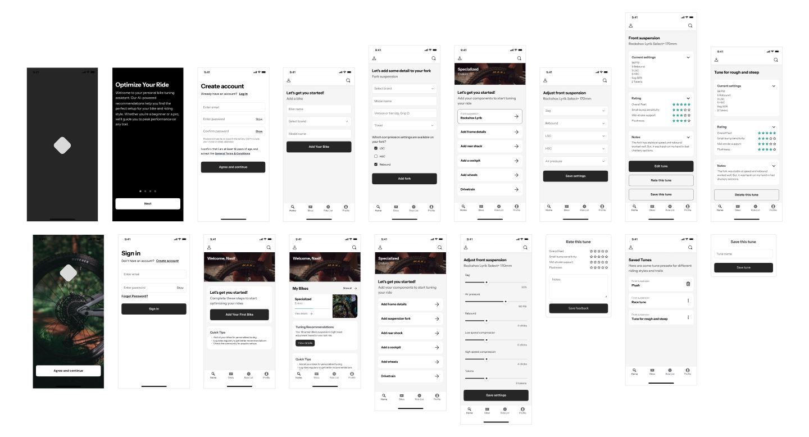
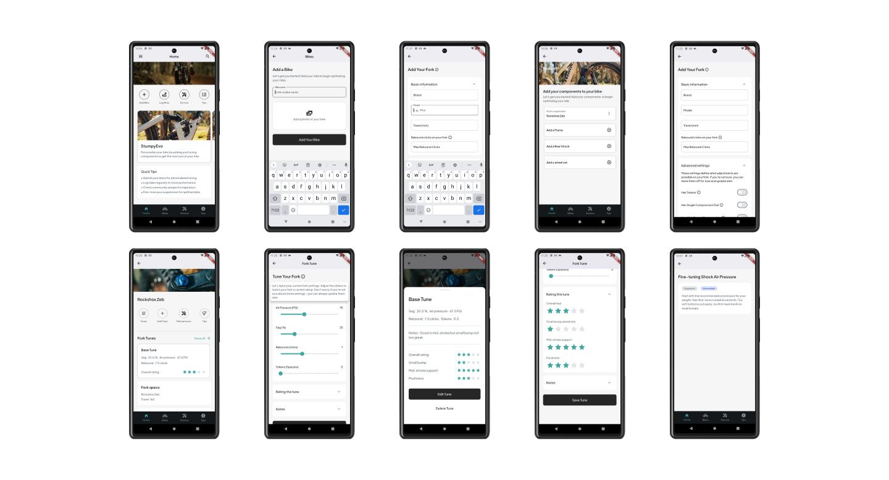
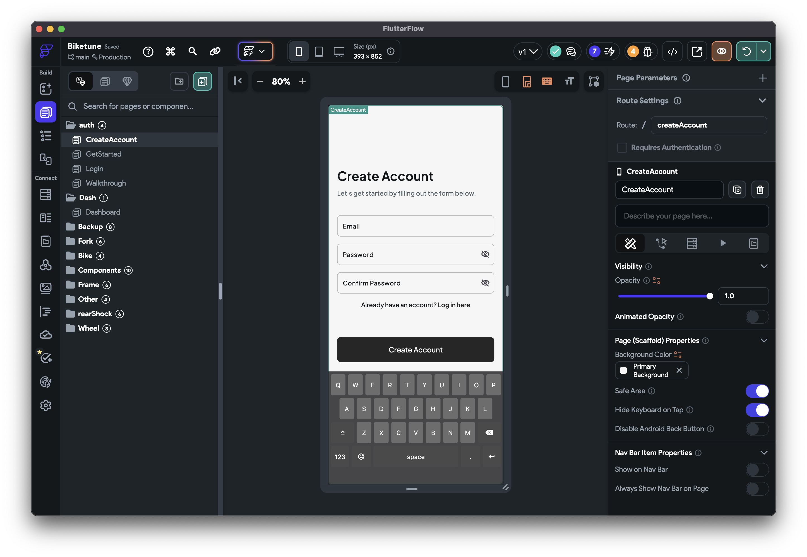

As an avid mountain biker, I've always struggled with optimizing my bike's setup for different trails and conditions. After years of manual adjustments and countless hours of trial and error, I decided to build something that could help riders like me quickly dial in their perfect setup. This project combines my passion for mountain biking with my expertise in AI and visual development.

## The Problem

Every rider faces the same challenges:
* Suspension settings that work perfectly on one trail feel completely wrong on another
* Weather conditions constantly force setup adjustments
* Component upgrades require complete retuning
* The learning curve for bike setup is incredibly steep
* Expert advice is expensive and not always available

## My Solution

I am currently developing an AI-powered mobile app that provides real-time bike setup recommendations based on rider preferences, trail conditions, and component specifications. The app will learn from both individual and community data to deliver increasingly accurate suggestions.




*Early prototype showing the suspension setup interface*

## Key Features

* Trail-Specific Profiles: Save and load configurations for different locations
* Component Database: Detailed specifications and setup ranges for popular parts
* Ride Journal: Track changes and their impact on performance
* Community Insights: Learn from other riders with similar bikes and styles
* AI-Powered Setup Assistant: Personalized suspension and tire pressure recommendations
* Custom tuning for different riding styles and components

## Development Journey

### Rapid Prototyping

Using Y Combinator's "fail fast" methodology, I:
* Used a rapid UX process with Claude AI to design the structure and data model
* Designed the app in Figma
* Built and tested the prototype in 3 weeks
* Conducted trail-side interviews with riders



*Building the prototype in FlutterFlow*

### Technical Stack

I chose technologies that would allow for rapid development and easy scaling:
* Frontend: Flutter/FlutterFlow for quick iteration
* Backend: Supabase for real-time data sync
* AI Engine: Claude API for intelligent recommendations
* Database: PostgreSQL for robust data management
* Auth: Supabase Auth for seamless user management

### Database Architecture

```sql
CREATE TABLE bikes (
    id UUID DEFAULT uuid_generate_v4() PRIMARY KEY,
    user_id UUID REFERENCES auth.users,
    brand TEXT NOT NULL,
    model TEXT NOT NULL,
    year INTEGER,
    created_at TIMESTAMP WITH TIME ZONE DEFAULT CURRENT_TIMESTAMP
);
```

## Field Testing Insights

Taking the prototype to our local trails for guerrilla testing proved invaluable. Watching riders interact with the app in real conditions revealed both challenges and opportunities I hadn't considered:

> "I love how I can quickly adjust my setup between runs and rate it, but could it remember my preferences for different trails? Like my setup for rock gardens versus flow trails?"
> 
> — Omar, Weekend Warrior

The testing sessions highlighted several key insights:

* Riders wanted to save different configurations for their favorite trails
* Network connectivity was a bigger issue than anticipated - users needed offline access
* Weather changes during rides meant users wanted quick adjustment suggestions
* More experienced riders requested detailed explanations behind the recommendations
* The community aspect emerged naturally as riders started sharing their successful setups

One particularly interesting observation came from watching riders use the app between runs:

> "Being able to quickly tweak settings between laps and track what works is game-changing. Though it would be great if it could somehow factor in fatigue - my ideal setup at the start of the day isn't always what I want by the end."
> 
> — Ameer, Local Rider

These real-world interactions helped shape the next iteration of features and highlighted the importance of building for actual trail conditions rather than ideal scenarios.

## Key Learnings

### Technical Insights
* FlutterFlow dramatically accelerated UI development
* AI significantly speeds up the prototyping process
* Offline functionality is crucial for trail use
* Real-world testing revealed unexpected use cases

### User Experience
* Riders prefer simple, actionable suggestions
* Visual guides are more effective than text
* Community validation builds trust
* UI and UX design to take the outdoors into account

## What's Next

I'm actively working on several enhancements:
* Improving the branding and visual language
* Expanded component database
* AI guided setup assistant
* Maintenance reminders and notifications

This project has been a perfect blend of my technical skills and passion for mountain biking. I'm excited to continue developing features that make bike setup more accessible to riders of all levels.